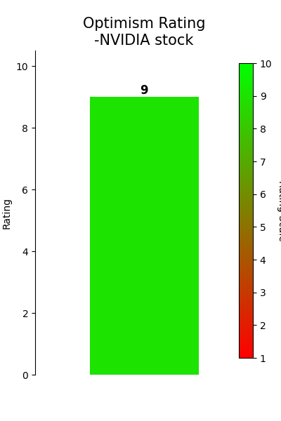
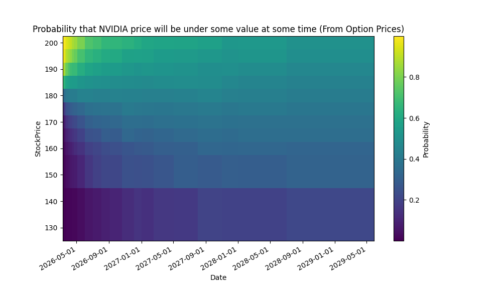

# QuantCodingProjects
Some Coding Projects to Explore some Quant Finance Methods.
We use python 3.13

These are just some fun coding projects which I do as a preparation to being a Quant.

**This Animation gets updated after every trading day**

If you want to understand how this animation was created, then you can check out the `plotProbabilitesNvidia_UpDown.ipynb` notebook.

## Nvidia sentiment analysis (Automatically updated after every trading day)

## Daily Updated Bullet Points for Sentiment Analysis for NVIDIA stock
<!-- BulletPointStart -->
- Nvidia is back in the spotlight as analysts lift price targets ahead of the Q2 earnings report on August 27, underscoring strong AI demand, market dominance, and easing U.S. export rules.

- Price targets have been raised: KeyBanc’s John Vinh to $215; Susquehanna’s Christopher Rolland to $210, both with Buy ratings; the Street’s consensus (Strong Buy) sits around $196.65 with roughly 12% upside from current levels.

- China revenue potential remains a factor: Nvidia’s forecast may exclude China due to license delays, but including China could add roughly $2–$3 billion in revenue from H20 and RTX6000D chips.

- Data-center momentum and new GB300/GB200 product lines are expected to drive double-digit revenue growth, supported by higher selling prices and stronger margins.

- Option activity and sentiment support optimism: Nvidia is among the biggest growth names in Wednesday’s option flow, and UBS/Oppenheimer price targets (e.g., $205 and $200) reinforce a bullish stance; current price around the mid-to-high $170s suggests meaningful upside.

<!-- BulletPointEnd -->
These Bullet Points get updated after every trading day
## plotProbabilitesNvidia_UpDown.ipynb

This notebook explains how to translate **option prices to probabilities** on where the price of a stock will be at future times. This is used to derive **probability density functions** which illustrate how likeley it is that a stock will be under/above some price at some time. See the animatino above or the following heatmap:

## TeslaOptionPriceGARCH.ipynb

In this notebook, we **predict the volatility** of the Tesla stock in advance using a **GARCH** model trained with the **historic volatility**. This is then used to price options with Black Scholes and the Binomial tree model. We compare the values we get with the **market values** and the **implied volatility** of said options. The actual prices we predicted differ from the market prices. We assume that our prediction gives us an edge (not really but just for the sake of coding and having a little bit of fun) and we construct a Delta and Gamma Hedged portfolio with calls, puts and the underlying tesla stock.
This is then used to build a **delta hedged** portfolio.

## pe_500s&p_by_sector_industry.ipynb

This notebook **scrapes** all the **S&P500 symbols from wikipedia**, then gets the **pe ratios and industries** from yahoo finance and then checks which companies have a pe ratio which is well below (1 std deviation) under the industries mean pe ratio. This is a very basic screening which might be interesting to fundamentalists.

## BlackScholesMonteCarloEuropoeanOptionPricing.ipynb
This is a notebook, where we do some **Monte Carlo Black Scholes optoion pricing**. We also use a **variance reduction method** for our monte carlo simulation, to improve the results, when we want to predict exotic europeans!

