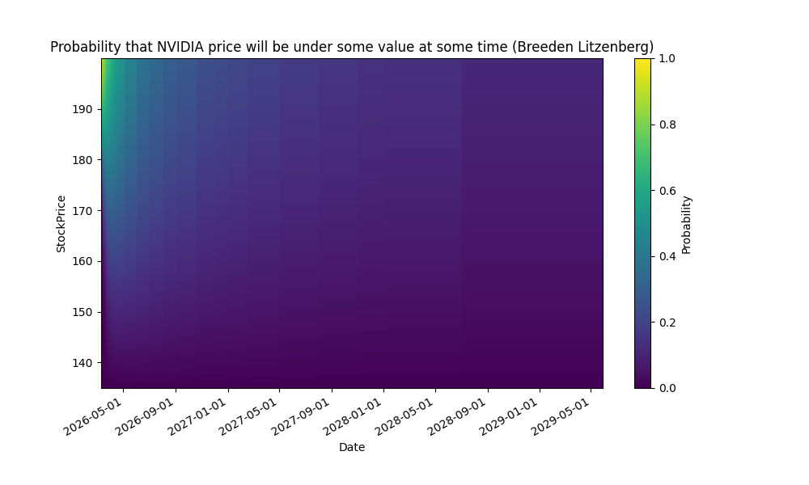
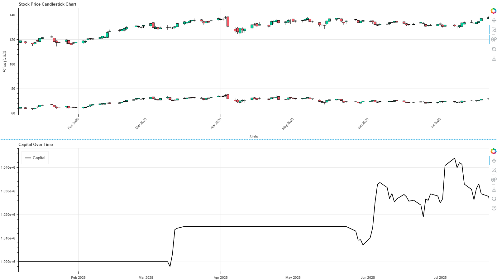

# QuantCodingProjects
Some Coding Projects to Explore some Quant Finance Methods.
We use python 3.13

These are just some fun coding projects which I do as a preparation to being a Quant.

**These Animations get updated after every trading day**

If you want to understand how this animation was created, then you can check out the `plotProbabilitesNvidia_UpDown.ipynb` notebook.

## Nvidia sentiment analysis (Automatically updated after every trading day with GitHub Actions)

<!---->

# Daily Updated Bullet Points for Sentiment Analysis for NVIDIA stock
<!-- BulletPointStart -->
- Wedbush analyst Dan Ives treats Nvidia’s recent pullback as a short-term dip and an opportunity to own a core AI winner, noting a demand-to-supply ratio of 10:1 for Nvidia’s chips and expecting Nvidia to drive the AI revolution.
- Ives says the AI boom is powering a tech rally and Nvidia is a central player, with the AI adoption wave just beginning to spread across more companies, potentially sustaining a multi-year bull cycle.
- Analysts broadly rate Nvidia as a Strong Buy alongside peers (MSFT, AVGO, MU), with price targets clustering in the high $190s to around $200s, signaling mid-teens upside from current levels.
- Regulators in China are moving to restrict sales of Nvidia’s China-specific AI processor H20, highlighting regulatory and geopolitical risks to Nvidia’s China business amid broader US-China tech tensions.
- Nvidia’s latest quarterly results show revenue of $44.06 billion and net profit of $18.78 billion; major firms maintain Buy ratings with targets around $200–$205, while insider sentiment turns negative with notable insider selling (e.g., Mark Stevens sold about 608,000 shares for around $88.35 million).

<!-- BulletPointEnd -->

These Bullet Points get updated after every trading day. They are based on news articles from [News Articles about Nvidia](https://markets.businessinsider.com/news/nvda-stock). They get summarized by ChatGPT into the bullet points above and on top of that ChatGPT gives an optimism ranking from 1-10 for the Nvidia stock based on the articles, which is displayed above.
## plotProbabilitesNvidia_UpDown.ipynb

This notebook explains how to translate **option prices to probabilities** on where the price of a stock will be at future times.
We explore **two possibilities to derive these probabilities**. One directly from the option prices and one via the **Breeden Litzenberg formula**
This is used to derive **probability density functions** which illustrate how likeley it is that a stock will be under/above some price at some time. See the animations above or compare the following heatmaps:

(These get updated daily)

## pairsTradingAndIndustryTrading.ipynb

1) In this notebook we search for correlated stocks in the S&P500. Since we do not want to compute a 500x500 **correlation matrix**, we instead only search for correlated **S&P500 stocks within each industry**. After we find a pair, we find the right scaling factor, to bring the stock prices to the same level (via a **linear regression model without intercept**). After that, we conduct an **Augmented Dickey–Fuller test**, to see if the increments of the two time serieses are in fact **stationary**. Then, we implement a simple **pairs trading strategy** within the backtesting framework, which I have implemented (see `src/backtesting`).

## Backtesting framework
I implemented a simple backtesting framework. The reason for this is that I was not happy with the python packages I found for backtesting strategies, since they either only work for single asset strategies or they are only supported by older python versions. To see the source code for this, check out `src/backtesting`. There you have a class `Backtester`, which implements (multiple asset) data feeding (via pandas DataFrames), ploting, reporting results and of course the actual backtesting engine. You will also find a class `Strategy`, which is mean to be a parent class which you can inherit to build your own trading strategy.

## TeslaOptionPriceGARCH.ipynb

In this notebook, we **predict the volatility** of the Tesla stock in advance using a **GARCH** model trained with the **historic volatility**. This is then used to price options with Black Scholes and the Binomial tree model. We compare the values we get with the **market values** and the **implied volatility** of said options. The actual prices we predicted differ from the market prices. We assume that our prediction gives us an edge (not really but just for the sake of coding and having a little bit of fun) and we construct a Delta and Gamma Hedged portfolio with calls, puts and the underlying tesla stock.
This is then used to build a **delta hedged** portfolio.

## pe_500s&p_by_sector_industry.ipynb

This notebook **scrapes** all the **S&P500 symbols from wikipedia**, then gets the **pe ratios and industries** from yahoo finance and then checks which companies have a pe ratio which is well below (1 std deviation) under the industries mean pe ratio. This is a very basic screening which might be interesting to fundamentalists.

## BlackScholesMonteCarloEuropoeanOptionPricing.ipynb
This is a notebook, where we do some **Monte Carlo Black Scholes optoion pricing**. We also use a **variance reduction method** for our monte carlo simulation, to improve the results, when we want to predict exotic europeans!

