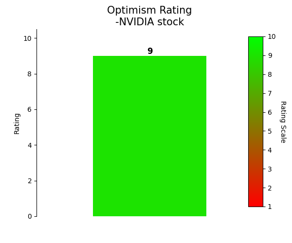
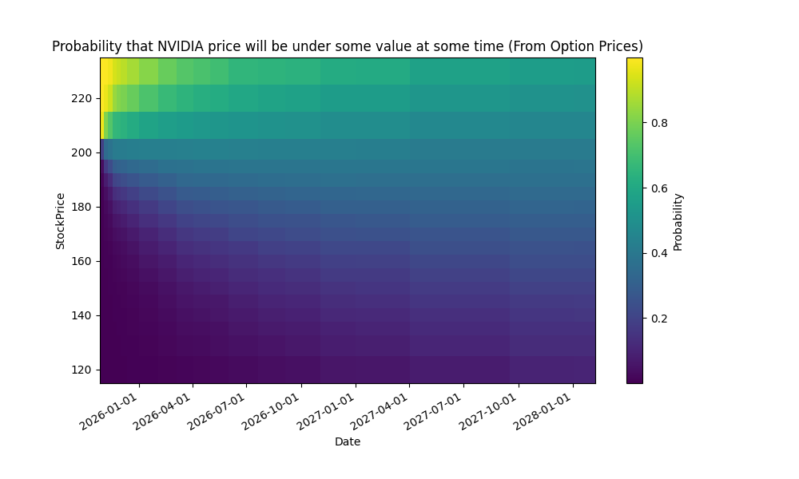
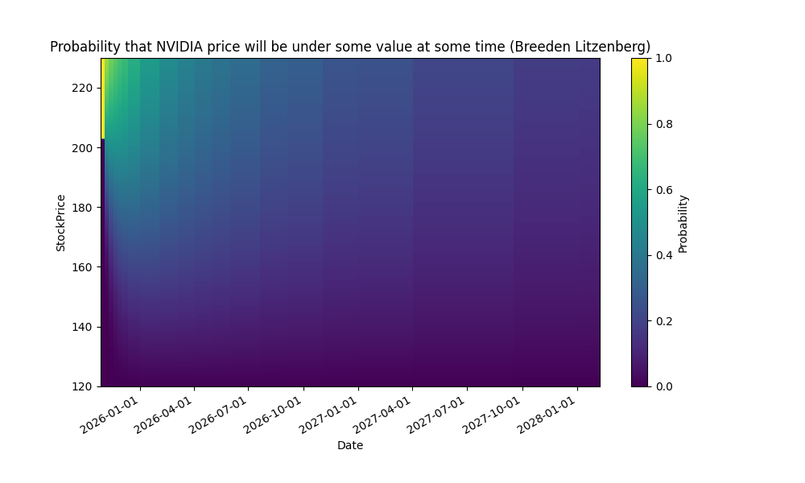
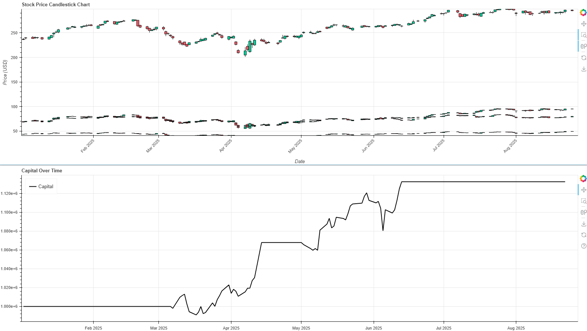

# QuantCodingProjects
Some Coding Projects to Explore some Quant Finance Methods.
We use python 3.13

These are just some fun coding projects which I do as a preparation to being a Quant.

# Overview
1) Sentiment Analysis Nvidia Stock with Chat GPT + Probabilities where Stock will go from option prices and Breeden Litzenberg (Daily Updated with GitHub Actions)
2) Trading Strategies and Backtesting with own Backtesting Framework
3) Prediction Tesla Option Prices wiht GARCH
4) S&P500 Stocks PE ratio filter (I use this for own retail investments)
5) Black Scholes Pricing and Variance Reduction Methods

# Sentiment Analysis Nvidia Stock with Chat GPT + Probabilities where Stock will go from option prices and Breeden Litzenberg

**These Animations get updated after every trading day**

If you want to understand how this animation was created, then you can check out the `plotProbabilitesNvidia_UpDown.ipynb` notebook.

## Nvidia sentiment analysis (Automatically updated after every trading day with GitHub Actions)

<!---->

## Daily Updated Bullet Points for Sentiment Analysis for NVIDIA stock
<!-- BulletPointStart -->
- Horizon data-center project: Poolside (backed by Nvidia) and CoreWeave will deploy 40,000 Nvidia GPUs for an eight-phase West Texas AI campus (initial 250 MW, with option to add 500 MW), leveraging on-site gas power to lower costs in the AI infrastructure race.
- AIP-backed acquisition of Aligned Data Centers: Nvidia is a key backer in the Artificial Intelligence Infrastructure Partnership, which plans to acquire Aligned Data Centers for about $40 billion, with initial equity of around $30 billion and potential debt up to $100 billion to fuel AI infrastructure expansion (close targeted for H1 2026).
- HSBC upgrade and ultra-bullish AI forecast: HSBC moves NVDA to Buy with a $320 target, citing a rapidly expanding AI data-center business and potential FY27 data-center revenue around $351 billion (vs. consensus ~$258B); 700k wafers at TSMC projected for FY2027; market upside signals remain strong (HSBC’s target implies ~78% upside).
- Nvidia GPUs in growing AI cloud builds: Nvidia’s hardware is central to multiple AI data-center efforts, including IREN’s renewal and deployment plan for thousands of Nvidia Blackwell GPUs in renewable-energy-powered AI cloud projects, underscoring sustained demand for Nvidia GPUs in cloud infrastructure.
- Elevated options activity around NVDA: NVDA shows notable options volume and positioning, with many new positions (e.g., Oct-25 165 puts and calls) and broad call/put activity, signaling ongoing investor interest and potential volatility around Nvidia’s AI-related growth catalysts. 

Market optimism rating for NVDA: 
<!-- BulletPointEnd -->

These Bullet Points get updated after every trading day. They are based on news articles from [News Articles about Nvidia](https://markets.businessinsider.com/news/nvda-stock). They get summarized by ChatGPT into the bullet points above and on top of that ChatGPT gives an optimism ranking from 1-10 for the Nvidia stock based on the articles, which is displayed above.
## plotProbabilitesNvidia_UpDown.ipynb

This notebook explains how to translate **option prices to probabilities** on where the price of a stock will be at future times.
We explore **two possibilities to derive these probabilities**. One directly from the option prices and one via the **Breeden Litzenberg formula**
This is used to derive **probability density functions** which illustrate how likeley it is that a stock will be under/above some price at some time. See the animations above or compare the following heatmaps:

(These get updated daily)

# Trading Strategies and Backtesting with own Backtesting Framework
## pairsTradingAndIndustryTrading.ipynb

1) In this notebook we search for correlated stocks in the S&P500. Since we do not want to compute a 500x500 **correlation matrix**, we instead only search for correlated **S&P500 stocks within each industry**. After we find a pair, we find the right scaling factor, to bring the stock prices to the same level (via a **linear regression model without intercept**). After that, we conduct an **Augmented Dickey–Fuller test**, to see if the increments of the two time serieses are in fact **stationary**. Then, we implement a simple **pairs trading strategy** within the backtesting framework, which I have implemented (see `src/backtesting`). (Above Picture of this strategy)

2) We also implement a mean reversion strategy with multiple stocks. We focus on bank stocks, which have a high VIF. The mean reversion is done with a linear model (without intercept, since assumption is, that if one correlated stock goes to zero than so do the other correlated sotcks), where the parameters are chosen to best resemble the bank stock with the highest VIF amongst the chosen ones, with the other stocks, i.e. 

X_{HighVif} = \beta _1 X_1 + ... +\beta _N X_N,

where X_{HighVif} and X_i are stocks of banks. If 

|I| = |\beta _1 X_1 + ... +\beta _N X_N  - X_{HighVif}| > B

then we buy and if 

| \beta _1 X_1 + ... +\beta _N X_N  - X_{HighVif} |< S

 then we sell for some thresholds  0 < S < B. Selling and buying a certain stock also depends on the sign of the respective \beta _i. This is again tested with our own backtesting framework.
To see, if the increments I are actually good for a mean reversion, we conduct an **Augmented Dickey–Fuller test**, which yields, that the time series is NOT stationary, but we also conduct a t test to check if the mean reverses to zero, which it does. Thus we infer,that the increments have periods of higher volatility and reverse to zero, which is perfect for a mean reversion strategy. (Above Picture of this strategy)

## Backtesting framework
I implemented a simple backtesting framework. The reason for this is that I was not happy with the python packages I found for backtesting strategies, since they either only work for single asset strategies or they are only supported by older python versions. To see the source code for this, check out `src/backtesting`. There you have a class `Backtester`, which implements (multiple asset) data feeding (via pandas DataFrames), ploting, reporting results and of course the actual backtesting engine. You will also find a class `Strategy`, which is mean to be a parent class which you can inherit to build your own trading strategy.

# Prediction Tesla Option Prices wiht GARCH
## TeslaOptionPriceGARCH.ipynb

In this notebook, we **predict the volatility** of the Tesla stock in advance using a **GARCH** model trained with the **historic volatility**. This is then used to price options with Black Scholes and the Binomial tree model. We compare the values we get with the **market values** and the **implied volatility** of said options. The actual prices we predicted differ from the market prices. We assume that our prediction gives us an edge (not really but just for the sake of coding and having a little bit of fun) and we construct a Delta and Gamma Hedged portfolio with calls, puts and the underlying tesla stock.
This is then used to build a **delta hedged** portfolio.

# S&P500 Stocks PE ratio filter (I use this for own retail investments)
## pe_500s&p_by_sector_industry.ipynb

This notebook **scrapes** all the **S&P500 symbols from wikipedia**, then gets the **pe ratios and industries** from yahoo finance and then checks which companies have a pe ratio which is well below (1 std deviation) under the industries mean pe ratio. This is a very basic screening which might be interesting to fundamentalists.

# Black Scholes Pricing and Variance Reduction Methods
## BlackScholesMonteCarloEuropoeanOptionPricing.ipynb
This is a notebook, where we do some **Monte Carlo Black Scholes optoion pricing**. We also use a **variance reduction method** for our monte carlo simulation, to improve the results, when we want to predict exotic europeans!

